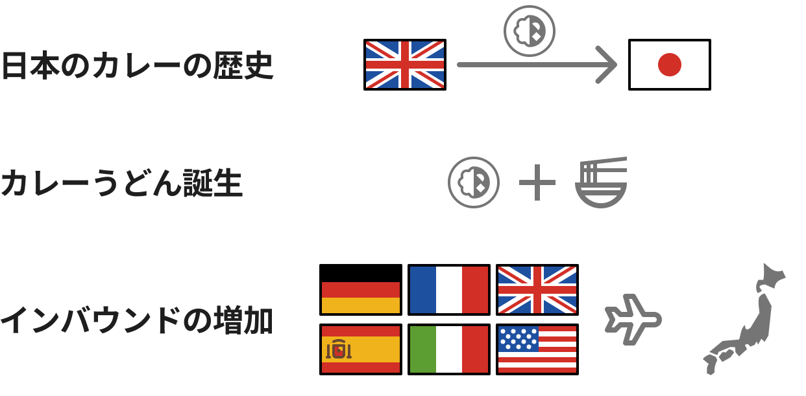
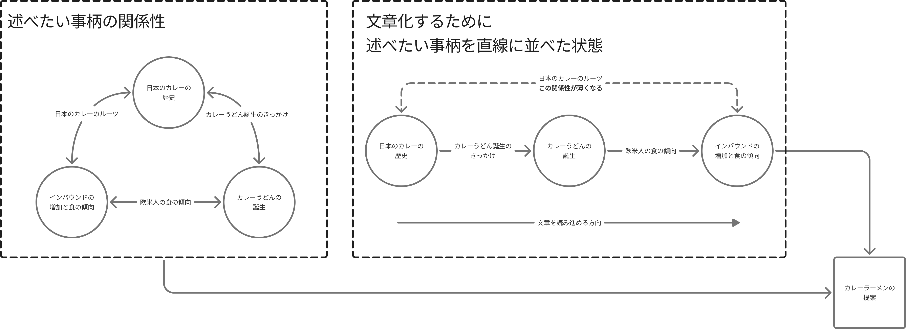

# はじめに

文章を書いていると，しばしば文字は線形的なメディアだと考えさせられる．

頭の中では情報が組みたてられているのに，
文章に起こす過程で解体して直線的に再配置しなければならない．

たとえば，A, B, Cというそれぞれが互いに関係性をもつ事柄を土台として，
Dということを主張したいとする．

「Aがある．また，Bと考えられている．さらに，Cである．そこでDを主張する．」

とすると，AとCは物理的，時間的に離れてしまい関係性が希薄になってしまう．
さらにCとAの関係性を記述すると，文章の構造は複雑化してしまい
「これは読む人も発散した文章に見えてしまうのでは？」
と考えることがある．

これは，文字がマクルーハンが言うところの，
**線形的・順序的な思考を促進するメディア**
だということが理由だと考えられる．

文章を読む時には，文字は文章の流れに沿って認識していくことになるので，そこには時間が存在する．
文字を順に追っていくと，次第に最初の地点からは物理的な距離は遠くなり，時間は過ぎ去っていく．

この記事では，このような文字というメディアの持つ特性について考えていく．

# 具体例

以下のような，具体例が考えられる．

<div className='my-8'>
    
</div>

- A. 日本のカレーの歴史について
    - 日本のカレーは，インドからイギリスに渡り日本にやってきた
    - 日本軍が，肉食を奨励したことで洋食が流行した
- B. カレーうどんの誕生
    - 洋食の流行で，うどん屋は洋食店に客を持って行かれた
    - 打開策としてカレーうどんが考案された
- C. 現代におけるインバウンドの増加と食の傾向
    - 欧米からのインバウンドが増加している
    - `ラーメン > うどん > 蕎麦` の順番に関心がある
    - Aの通り，日本のカレーはイギリス由来であるため，欧米人にも馴染み深い
- D. **インバウンド向けのカレーラーメンを提案する**

上記の内容を時系列順に文章に起こすと，大体以下のようになる．

```txt
日本のカレーはイギリス由来だ．これは日本軍が奨励したことがきっかけだ．

さらに，一般家庭にイギリスカレーが浸透したことにより，洋食が流行した．
このような洋食ブームでうどん屋や蕎麦屋は洋食店の客足は遠のいていった．
そこで，打開策としてカレーうどんが考案されたと言われている．

また，近年では，欧米のインバウンド観光客が増加しているが，
欧米人が関心を持っている日本の麺類はまずラーメン，次いでうどん，最後に蕎麦だと言われている．
上述の通り，日本のカレーはイギリス由来なので欧米人にも馴染み深いと考えられる．

そこで，インバウンド向けのカレーラーメンを提案する．
```

<div className='my-8'>
    
</div>

この程度の文章なら，作文の工夫でAとCの関係性を強調することもできると考えられる．
しかし，一段落と三段落は物理的な距離も遠ざかり関係性がやや希薄になる．
さらに，実際にこのような文章を書くならば，
既存のカレーラーメンやインスタントのカレーヌードル，スープカレーへの言及も必要になるだろう．
すると，さらに段落間の関係性はさらに複雑になり，関係性は希薄になってしまう．

# 関連書籍や作品，製品

## モザイク的メディア: マーシャル・マクルーハン

マクルーハンは，文字のことを線形的・順序的な思考を促進するメディアだと述べている．

マクルーハンは著書『グーテンベルクの銀河系 : 活字人間の形成』の中で，
新聞を本の形態のモザイク的な後継者と述べている．
モザイクは集合的イメージを扱い，深い参加を要求する．

また，この書籍自体がさまざまな要素をモザイク状に散りばめられて構成されており，
非線形的な文章を意識して執筆されていると言われている．

## 藤幡正樹: ハイパーリンクを使った実験

藤幡正樹は著書『不完全な現実』の中で，大学の授業における取り組みを紹介している．

この取り組みでは，授業を受けている学生一人一人が一枚のHTMLのページを制作する．
各HTMLには「そっち」や「あそこ」などの指示語を記述されており，
この指示語に貼られたハイパーリンクにより，HTMLを相互に行き来するものだ．

この取り組みを，文字の線形性と結びつけるのは，藤幡の意図から逸れると考えられるが，
このようなハイパーリンクによる参照関係は，
文字というメディアが持つ線形的な特徴を作り替えるのではと考えた．

## Obsidian

Obsidianは、Markdownでノートやメモを記述できるテキストエディタだ．
一番の特徴は，記述した文書をエッジとしてリンクを貼ることにより文書間の関係性を可視化することができる点だ．

このアプリケーションを挙げた理由は，
藤幡の取り組みと同じく文字というメディアが持つ線形的な特徴を作り替えるのではと考えたからだ．

また，文字でありながら，非線形的な特徴を持つメディアが製品として成り立っているという点も興味深い点である．


# 習作

この記事の執筆にあたり，二つの習作を制作した．

## グラフ構造の可視化

ノードに表示されているタイトルをクリックすると，
段落をモーダルで確認することができる．
Obsidianに似ているがエッジに関係性を表示することで，
関係性自体も情報として表示している．

import TextGraph from '../../src/components/TextGraph'

<div className="flex justify-center my-8">
    <TextGraph width={650} height={400} nodes={[
        { id: 1, summary: '日本のカレー', text: '日本ではイギリス由来のカレーが一般的だ．\nこれは日本軍が奨励して流行したことに由来する．' },
        { id: 2, summary: 'カレーうどん誕生', text: '洋食ブームにより，\nうどん屋は洋食店に客を持って行かれた．\nそこで打開策としてカレーうどんが考案した．' },
        { id: 3, summary: 'インバウンドの食の傾向', text: '近年では，インバウンドの増加しているが，\n欧米人はラーメン > うどん > 蕎麦\nの順に関心がある．' },
    ]} links={[
        { source: 1, target: 2, text: '洋食' },
        { source: 2, target: 3, text: '麺類' },
        { source: 3, target: 1, text: '日本と西洋' },
    ]} className="content-center bg-slate-100"/>
</div>

## 傘連判状もしくはラウンドロビン形式

傘連判状は，室町時代から江戸時代にかけて、用いられた円環状の署名形式だ．
一揆などの首謀者を隠すために用いられたことで知られている．
また，フランスの農民が国王への嘆願書を書く際に，ラウンドロビン方式という同様の手法が取られていた．

この例文は循環しているように見えたので，無限にスクロールする習作を作成した．
関係性が循環している文章に対しては，このような見せ方ができると考えられる．
また，順序をなくすために，各段落の接続詞は削除している．

import InfiniteScrollBox from "../../src/components/InfiniteScrollBox"

<div className="flex justify-center my-8">
    <InfiniteScrollBox className="bg-slate-100 w-full md:w-1/2 h-40 [&_p]:indent-3">
        <p>日本軍が奨励して流行したことにより，日本ではイギリス由来のカレーが一般的だ．</p>
        <p>洋食ブームにより，うどん屋は洋食店に客を奪われたことで，打開策としてカレーうどんが考案した．</p>
        <p>近年では，インバウンドの増加しているが，欧米人はラーメン > うどん > 蕎麦の順に関心がある．</p>
    </InfiniteScrollBox>
</div>

# おわりに

この記事では，文字の線形性に関する考察を行うために，
幾つかの先行研究や作品，製品をあげた上で，二つの習作を示した．

習作は二つとも単純な例になったが，コンピュータのインタラクションを活用することで，
文字というメディアが持つ線形的な特性を，作り替えることを試みた．

もし，小説などの物語を書く場合，このようなメディアの形式と合わせて制作することができれば，
コンテンツとフォーマットの両方から作品を表現できるのではないかと考える．

これは，ここまで書いてからふと思ったことなのだが，
非線形的な文章としてゲームが挙げられると考えた．
ゲームは，基本的には線形的に過ぎ去っていく文章だが，
分岐や周回を体験することになる場合がある．
分岐は異なる組み合わせの文章を作りだし，
周回は循環する文章構造を作り出す．
この分岐と繰り返しは，プログラムングの基本的な制御構造だ．
つまりは，コンピュータを使った文章は，
文字の持つ線形的なメディアの特性を変化させたと考えられる．

このように，コンピュータによる処理の分岐や繰り返し，
ハイパーリンクによる参照などの特性を活用することで，
非線形的な文章による表現が可能になると考える．

しかし，昨今では生成AIの利用が活発になっている．
これはインターネット上にモザイク的に散りばめられた情報を，
線形的な文章にまとめる性質があると考えられる．
これにより，モザイク的でクールなメディアであったインターネットは，
線形的でホットなメディアへと変化していくのかもしれない．

## 参考文献

- 藤幡正樹, 不完全な現実 : デジタル・メディアの経験, NTT出版, 2009.3. 978-4-7571-7038-4.
- マーシャル・マクルーハン, グーテンベルクの銀河系 : 活字人間の形成, みすず書房, 1986.2. 4-622-01896-9, 10.11501/12107698.
- Shida Li, Erica Xu, Obsidian, [https://obsidian.md/](https://obsidian.md/)
